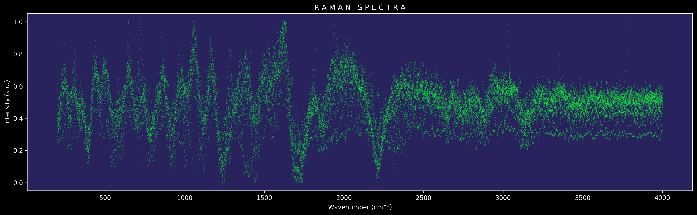

# Taking the image raman.png and showing the spectrum



# raman

Jupyter notebook con un tratamiento de datos especializado en espectroscopía Raman.
Para ejemplificar su uso se integran algunas muestras en la carpeta de muestras.

Entre las acciones posibles estan disponibles al momento:

- Graficar y guardar dentro de subdirectorios de forma automática como imágenes (Ya se puede crear una representación tipo video).
- Ajustar linea base de tipo gauss o polinomio.
- Graficar de manera interactiva un intervalo de los datos para enfocarnos en una región y trabajar sobre esta.
- Remover puntos muy lejanos a los pares x,y.


# Para utilizar las herramientas
Se necesita instalar conda y despues en esta carpeta ejecutar:
```
conda env create --file environment.yaml
```

Despues de tener el ambiente activado se puede ejecutar el notebook con vscode o con jupyter lab.

Las visualizaciones se pueden guardar como imagenes o como video.

Una vez que se tiene una visualizacion se puede comprimir:

`
ffmpeg -i vid.mp4 -c:v libx264 -crf 23 -preset medium -c:a aac -b:a 128k output.mp4
`